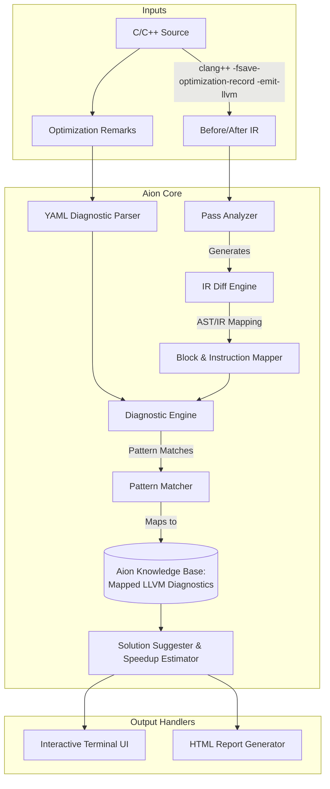

<div align="center">
  
</div>


Aion is a diagnostic engine designed to bridge the gap between high-level language abstractions and the LLVM optimization pipeline. By correlating optimization remarks with multi-context IR analysis, Aion provides technical explanations and actionable resolutions for compiler failure points.

This tool implements O(N) diagnostic lookup, stable basic-block identity tracking, and standardized regression metrics to ensure reliability for systems engineers.



## Technical Implementation

Aion integrates with LLVM C++ APIs to process compiler data constraints:

### 1. Dual-Context Parsing Engine
LLVM ties `llvm::Module` instances to their parent `llvm::LLVMContext`. To compare different states of IR (the "Before" and "After" snapshots) safely, Aion utilizes a dual-context session. Multiple `.ll` files are isolated within their own `std::unique_ptr<llvm::LLVMContext>` allocations, preventing context mixing and memory corruption while the diagnostic pattern matching correlates the transformations.

### 2. YAML Diagnostic Parser
Compilers like `clang` emit `-fsave-optimization-record` YAMLs containing string lists that are inconsistently quoted. Aion implements a specialized YAML argument parser designed to handle these raw structures. It parses the line delimiters down to the `DebugLoc` (Line & Column) and reconstructs the multi-array compiler messages.

### 3. Diagnostic Matcher
LLVM emits remarks categorized under generic identifiers (e.g., `loop-vectorize: MissedDetails`). However, the actual root cause is embedded within the `Args` field. The `DiagnosticEngine` maps these raw string patterns to documented optimization requirements.
For example, if Aion parses a `write-after-read` alias assumption drop from `loop-vectorize`, it outputs:
* **The Root Explanation:** Details the exact memory dependency blockade.
* **The Speedup Estimator:** Calculates the theoretical vectorization width based on target intrinsics.
* **The Solution:** Outputs the required `__restrict__` qualifier, `#pragma clang loop vectorize(assume_safety)`, or memory padding adjustments.

## Building from Source

Aion requires LLVM 15.0+ installed and built with CMake.

```bash
mkdir build && cd build
cmake .. -DLLVM_DIR=/path/to/llvm-project/build/lib/cmake/llvm/
make -j$(nproc)
```

## Usage

Generate optimization remarks during compilation, then pass them to Aion alongside the IR:

```bash
# 1. Compile the code and generate the LLVM optimization record
clang++ -O2 -fsave-optimization-record -emit-llvm -S test/victim.cpp -o test/victim.ll

# 2. Run the debugger
./build/opt-debugger --before=test/victim.ll --after=test/victim.ll --remarks=test/victim.opt.yaml
```

**Example Output:**
```text
================================================================================
[!!] [CRITICAL] Loop vectorization blocked: memory dependency / aliasing
  Pass     : loop-vectorize
  Function : @complex_loop
  Location : test/victim.cpp:3:17
  Potential speedup if fixed: 4.0x

--------------------------------------------------------------------------------
  ROOT CAUSE
--------------------------------------------------------------------------------
  A read-after-write, write-after-read, or write-after-write dependency between 
  iterations was found or could not be ruled out by alias analysis.

--------------------------------------------------------------------------------
  WHAT THE OPTIMIZER WANTED TO DO
--------------------------------------------------------------------------------
  The optimizer wanted to load/store multiple elements simultaneously using 
  SIMD gather/scatter or contiguous loads, but the dependency prevents reordering 
  memory operations.

--------------------------------------------------------------------------------
  HOW TO FIX THIS
--------------------------------------------------------------------------------
    1. If you know the arrays do not alias, add __restrict__ to all pointer parameters
      | void f(int* __restrict__ out, const int* __restrict__ in, int n)
```

## Supported Diagnostics

Aion recognizes an expansive set of common missed optimizations, including:
- **Loop Vectorization**: Missing bounds, unsafe memory operations, non-reducible accumulators.
- **Inlining**: Cost threshold constraints, recursion, unavailable LTO definitions.
- **SROA (Scalar Replacement of Aggregates)**: Escaping pointers, memory-to-register promotion blockades.
- **Tail Call Elimination & Loop Unrolling**: Precondition violations causing missed loop peeling or tail jumps.
